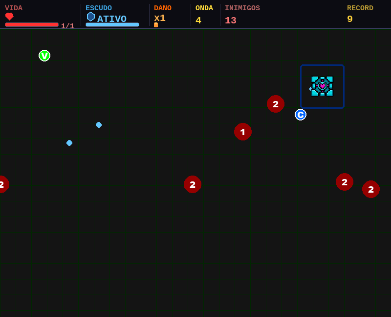
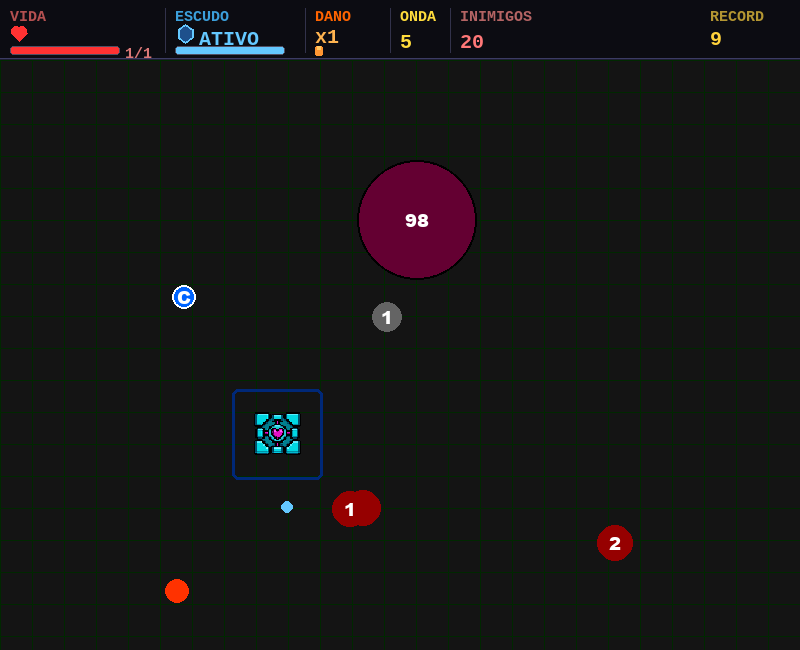
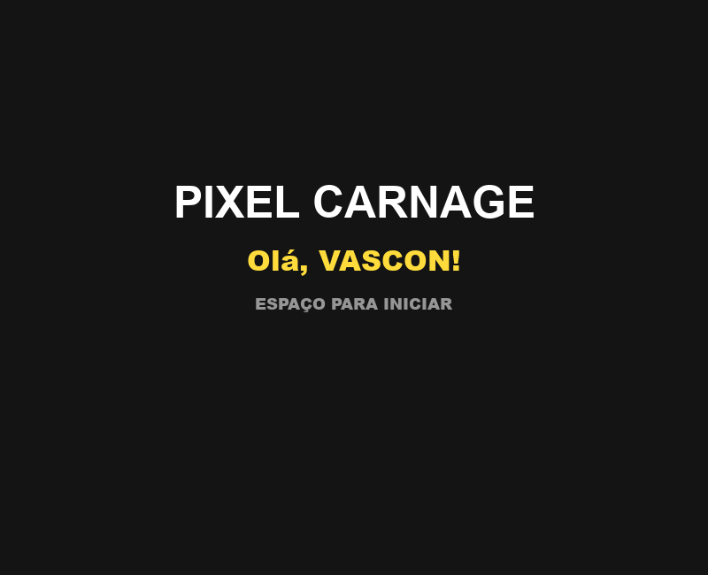

<h1 align="center">PIXEL CARNAGE</h1>

<p align="center">
  Um arena shooter top-down de ondas infinitas, escrito do zero em Python com pygame.
</p>

<p align="center">
  
  
  
</p>

<!--
  IMAGENS — para adicionar:
  1. Rode o jogo e capture 2 ou 3 telas (menu, gameplay com muitos inimigos, luta de boss).
  2. Crie a pasta docs/ neste repositório e coloque os arquivos lá.
  3. Apague este comentário e descomente o bloco abaixo.

<p align="center">
  
</p>

<p align="center">
  
  
</p>
-->

## O jogo

Você é o último ponto vivo numa arena fechada. Inimigos entram pelas quatro bordas
em ondas que nunca param, e cada onda vem mais rápida, mais numerosa e mais dura
que a anterior. Não existe tela de vitória — existe a onda em que você morreu, e
ela vai para o ranking.

O que mantém a coisa de pé é a economia de risco: você tem **uma vida**. O que te
separa da morte é um escudo que absorve um golpe e leva tempo para voltar. Cada
segundo dentro da arena é uma escolha entre juntar o coletável no meio da horda ou
recuar e deixar o upgrade sumir.

## Como jogar

| Tecla | Ação |
|---|---|
| `W` `A` `S` `D` | Mover (com inércia — o ponto desliza, não para seco) |
| `↑` `↓` `←` `→` | Mirar e atirar na direção escolhida |
| `Q` | Boomerang, depois de 50 abates |
| `Espaço` | Começar a partida / recomeçar após morrer |
| `Esc` | Pausar |
| `Enter` | Confirmar o nome (até 6 caracteres) |

Movimento e mira são independentes: dá para recuar atirando para trás, e é assim
que se sobrevive às ondas altas.

## Mecânicas

**Escudo em vez de barra de vida.** Você começa com 1 de vida e o escudo ativo. O
primeiro golpe quebra o escudo e te dá 2 segundos de intangibilidade; o escudo só
volta 5 segundos depois disso. São 5 segundos em que qualquer encostão mata. O som
avisa quando ele regenerou — vale aprender a escutar em vez de olhar o HUD.

**Ondas que endurecem por camadas.** Inimigos ganham vida e velocidade a cada
onda. A partir da onda 3 aparecem os `ÁGIL`, menores e muito mais rápidos. Na 6
começam os gigantes, com o dobro de vida. Na 10 a vida passa a crescer de forma
exponencial. Na 15 os inimigos ganham dash e passam a fechar distância de repente.

**Boss a cada 5 ondas.** Ele entra anunciado por nome ("O SLIME SUPREMO CHEGOU!"),
tem 100 de vida — mais 100 a cada 5 ondas depois da 10 — e cospe lacaios a cada
3,5 segundos. Matá-lo não resolve: ele se parte em dois bosses médios, que se
partem de novo em pequenos.

**Coletáveis.** Caem pela arena e somem em 8 segundos — a exceção é o boomerang,
que espera por você:

| Item | Efeito |
|---|---|
| `V` verde | Mais velocidade de movimento |
| `C` azul | Mais cadência de tiro |
| `H` vermelho | Recupera vida |
| `B` | Libera o boomerang |
| `TRI` | Chance de tiro triplo |
| `BACK` | Tiro adicional na direção oposta |
| `BOUNCE` | Projéteis ricocheteiam nas paredes |

**Ranking local.** Ao morrer, o nome e a onda alcançada vão para o `ranking.json`,
que fica no próprio repositório — o placar sobrevive entre partidas.

## Rodando

Requer Python 3.8 ou superior (o código usa apenas f-strings como sintaxe moderna).

```bash
git clone https://github.com/Vascon11/game_PIXEL-CARNAGE.git
cd game_PIXEL-CARNAGE/gameteste
pip install pygame
python pixel_carnage.py
```

No Linux, se o áudio não iniciar, verifique se o SDL está com um driver de som
disponível — o jogo carrega música e cinco efeitos no boot e não sobe sem eles.

## Estrutura

```
gameteste/
├── pixel_carnage.py        # o jogo inteiro: loop, entidades, HUD, estados
├── IA_jogador.png          # sprite do jogador
├── Musica_de_fundo.mp3     # trilha
├── tiro.wav                # efeitos
├── escudo_quebra.wav
├── escudo_regenerando.wav
├── troca_tela.wav
├── morte_teste_ainda.wav
└── ranking.json            # placar persistido
```

## Notas técnicas

O jogo é um arquivo só, com um laço principal e uma máquina de estados simples
(`NOME` → `MENU` → `JOGANDO` → `PAUSA` / `GAMEOVER`). As entidades são três
classes — `Jogador`, `Inimigo`, `Projetil` — mais `Coletavel`, todas com o mesmo
par `atualizar()` / `desenhar()`, e a colisão é por distância entre centros, sem
`pygame.sprite`.

Duas decisões que moldaram o resto: o movimento usa interpolação de velocidade com
fator de inércia em vez de posição direta, o que dá o deslize característico; e a
dificuldade não é uma tabela de ondas, é uma função da onda atual, então o jogo
continua escalando muito depois da última onda que alguém já alcançou.
